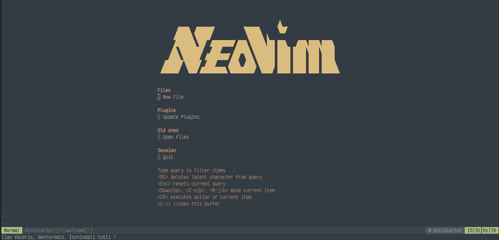
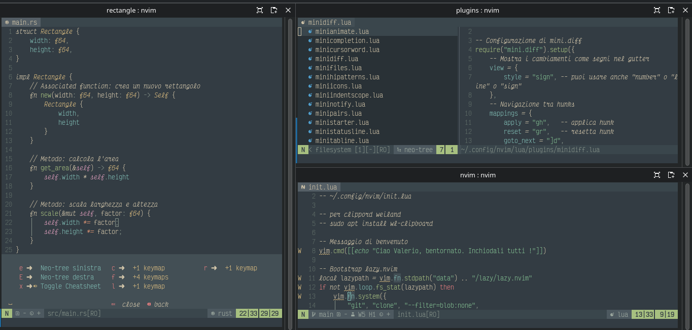
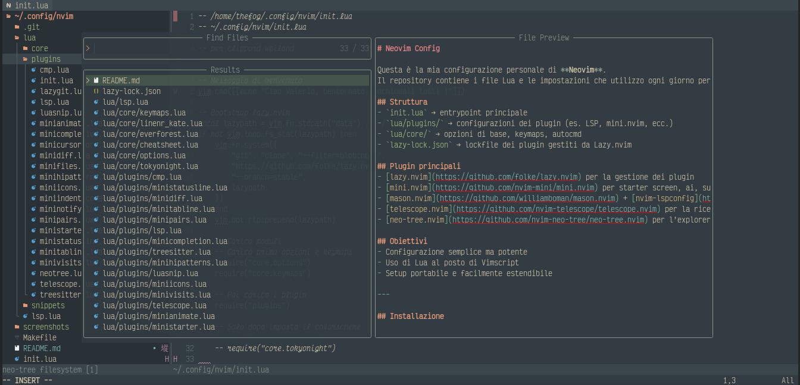

# Neovim Config

Questa è la mia configurazione personale di **Neovim**.  
Il repository contiene i file Lua e le impostazioni che utilizzo ogni giorno per sviluppare, scrivere e sperimentare con Neovim.

## Struttura
- `init.lua` → entrypoint principale  
- `lua/plugins/` → configurazioni dei plugin (es. LSP, mini.nvim, ecc.)  
- `lua/core/` → opzioni di base, keymaps, autocmd  
- `lazy-lock.json` → lockfile dei plugin gestiti da Lazy.nvim  

## Plugin principali
- [lazy.nvim](https://github.com/folke/lazy.nvim) per la gestione dei plugin  
- [mini.nvim](https://github.com/nvim-mini/mini.nvim) per starter screen, ai, surround, ecc.  
- [mason.nvim](https://github.com/williamboman/mason.nvim) + [nvim-lspconfig](https://github.com/neovim/nvim-lspconfig) per LSP  
- [telescope.nvim](https://github.com/nvim-telescope/telescope.nvim) per la ricerca  
- [neo-tree.nvim](https://github.com/nvim-neo-tree/neo-tree.nvim) per l’explorer dei file  

## Obiettivi
- Configurazione semplice ma potente  
- Uso di Lua al posto di Vimscript  
- Setup portabile e facilmente estendibile  

---

## Installazione

### 🔤 Font consigliato  
Utilizzo **Victor Mono Nerd Font**:  
https://www.nerdfonts.com/font-downloads  

Installalo tramite il gestore font del tuo sistema (su KDE Plasma basta aprire il file `.ttf` e cliccare *Installa*).

---

### 📦 Dipendenze (Debian 13 “Trixie” + KDE Plasma)

Per abilitare il supporto alla clipboard su Wayland:

```bash
sudo apt install wl-clipboard
```

---

### 📁 Clonazione della configurazione

Clona il repository nella cartella di configurazione di Neovim:

```bash
git clone https://github.com/<tuo-username>/nvim ~/.config/nvim
```

---

### 📚 Plugin Manager: Lazy.nvim

Lazy.nvim viene installato automaticamente al primo avvio se non presente.  
Assicurati che il bootstrap sia incluso nel tuo `init.lua`.

---

### 🎨 Colorscheme

Il tema utilizzato è **Everforest**.  
È configurato tramite Lazy.nvim e attivato all’avvio.

---

## 📸 Screenshots

> Alcune anteprime della mia configurazione Neovim con tema **Everforest** su KDE Plasma (Wayland).

*(Aggiungi qui le tue immagini, ad esempio:)*

```



```

---

## ⌨️ Keymaps principali

Ecco una panoramica delle scorciatoie che uso più spesso.  
Sono pensate per essere semplici, mnemoniche e veloci.

## troverai tutto in cheatsheet

### 🔍 Ricerca (Telescope)
| Azione | Tasto |
|-------|-------|
| File recenti | `<leader>fr` |
| Cerca file | `<leader>ff` |
| Live grep | `<leader>fg` |
| Cerca buffer | `<leader>fb` |

### 📁 File Explorer (Neo-tree)
| Azione | Tasto |
|-------|-------|
| Apri/chiudi explorer | `<leader>e` |

### 🧠 LSP
| Azione | Tasto |
|-------|-------|
| Vai alla definizione | `gd` |
| Mostra hover | `K` |
| Lista riferimenti | `gr` |
| Rinomina simbolo | `<leader>rn` |
| Formattazione | `<leader>fm` |

### 📝 Editing (mini.nvim + custom)
| Azione | Tasto |
|-------|-------|
| Surround | `sa`, `sd`, `sr` |
| Commenta | `gc` |
| Selezione intelligente | `v` (mini.ai) |

### 🪄 Varie
| Azione | Tasto |
|-------|-------|
| Salva | `<leader>w` |
| Chiudi buffer | `<leader>q` |
| Apri terminale flottante | `<leader>t` |

---

Perfetto, ti preparo **un logo ASCII elegante** per il tuo README e una **sezione badge** in stile moderno, così il progetto sembra subito più professionale.

---

# 🎨 Logo ASCII

Puoi inserirlo all’inizio del README, sopra il titolo:

```
 _   _                 _           
| \ | | ___  _____   _(_)_ __ ___  
|  \| |/ _ \/ _ \ \ / / | '_ ` _ \ 
| |\  |  __/ (_) \ V /| | | | | | |
|_| \_|\___|\___/ \_/ |_|_| |_| |_|
        N E O V I M   C O N F I G
```

Oppure una variante più “minimal”:

```
███╗   ██╗███████╗ ██████╗ ██╗   ██╗██╗███╗   ███╗
████╗  ██║██╔════╝██╔═══██╗██║   ██║██║████╗ ████║
██╔██╗ ██║█████╗  ██║   ██║██║   ██║██║██╔████╔██║
██║╚██╗██║██╔══╝  ██║   ██║╚██╗ ██╔╝██║██║╚██╔╝██║
██║ ╚████║███████╗╚██████╔╝ ╚████╔╝ ██║██║ ╚═╝ ██║
╚═╝  ╚═══╝╚══════╝ ╚═════╝   ╚═══╝  ╚═╝╚═╝     ╚═╝
```
Io uso questa

```                                                            
                                                                   
      ████ ██████           █████      ██                    
     ███████████             █████                             
     █████████ ███████████████████ ███   ███████████   
    █████████  ███    █████████████ █████ ██████████████   
   █████████ ██████████ █████████ █████ █████ ████ █████   
 ███████████ ███    ███ █████████ █████ █████ ████ █████  
██████  █████████████████████ ████ █████ █████ ████ ██████ 
```


---

# 🏷️ Badge

Ecco una sezione badge già pronta da incollare:


<p align="center">
  
  
  
  
  
  
</p>
<p align="center">
  
  
  
  
  
  
</p>


---

